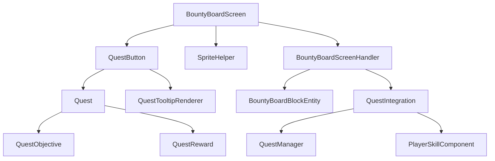

# Дизайн переноса интерфейса доски объявлений из Bountiful

## Обзор

Данный дизайн описывает процесс переноса интерфейса доски объявлений из оригинального мода Bountiful (Kotlin) в проект Origins (Java). Основная цель - адаптировать существующий визуальный стиль и функциональность под систему квестов Origins.

## Архитектура

### Исходная архитектура Bountiful

1. **BoardScreen.kt** - основной экран интерфейса
2. **BoardScreenHandler.kt** - обработчик экрана для синхронизации клиент-сервер
3. **BountyLongButton.kt** - кнопка для отображения квестов
4. **BoardBlock.kt** - блок доски объявлений
5. **BoardBlockEntity.kt** - блок-сущность для хранения данных

### Целевая архитектура Origins

1. **BountyBoardScreen.java** - адаптированный экран интерфейса
2. **BountyBoardScreenHandler.java** - обработчик экрана
3. **QuestButton.java** - кнопка для отображения квестов
4. **BountyBoard.java** - блок доски объявлений
5. **BountyBoardBlockEntity.java** - блок-сущность

## Компоненты и интерфейсы

### 1. BountyBoardScreen

**Исходный код (Kotlin):**
```kotlin
class BoardScreen(handler: ScreenHandler, inventory: PlayerInventory, title: Text) :
    KambrikHandledScreen<ScreenHandler>(handler, inventory, title)
```

**Целевой код (Java):**
```java
public class BountyBoardScreen extends HandledScreen<BountyBoardScreenHandler> {
    private static final Identifier TEXTURE = new Identifier("origins", "textures/gui/container/bounty_board.png");
    private static final int BACKGROUND_WIDTH = 348;
    private static final int BACKGROUND_HEIGHT = 165;
    
    private List<QuestButton> questButtons = new ArrayList<>();
    private QuestButton selectedQuest = null;
    private int scrollOffset = 0;
}
```

### 2. Система спрайтов

**Исходная система (Kambrik):**
```kotlin
private val BOARD_SHEET = KSpriteGrid(TEXTURE, texWidth = 512, texHeight = 512)
private val BOARD_BG_BIG = BOARD_SHEET.Sprite(0f, 0f, 348, 165)
private val BOARD_BG_SMALL = BOARD_SHEET.Sprite(0f, 166f, 176, 165)
```

**Целевая система (стандартный Minecraft):**
```java
public class SpriteHelper {
    public static void drawSprite(DrawContext context, int x, int y, int u, int v, int width, int height) {
        context.drawTexture(TEXTURE, x, y, u, v, width, height, 512, 512);
    }
    
    public static void drawBoardBackground(DrawContext context, int x, int y, boolean expanded) {
        if (expanded) {
            drawSprite(context, x, y, 0, 0, 348, 165);
        } else {
            drawSprite(context, x, y, 0, 166, 176, 165);
        }
    }
}
```

### 3. QuestButton

**Функциональность:**
- Отображение иконок целей квеста
- Отображение иконок наград
- Обработка кликов мыши
- Подсветка при выделении
- Подсказки при наведении

```java
public class QuestButton extends ClickableWidget {
    private final BountyBoardScreen parent;
    private final Quest quest;
    private final int questIndex;
    
    public QuestButton(BountyBoardScreen parent, Quest quest, int index) {
        super(0, 0, 160, 20, Text.empty());
        this.parent = parent;
        this.quest = quest;
        this.questIndex = index;
    }
    
    @Override
    public void renderButton(DrawContext context, int mouseX, int mouseY, float delta) {
        // Отрисовка фона кнопки
        drawButtonBackground(context);
        
        // Отрисовка иконок целей
        renderObjectiveIcons(context);
        
        // Отрисовка иконок наград
        renderRewardIcons(context);
        
        // Подсветка при выделении
        if (isSelected()) {
            drawSelectionHighlight(context);
        }
    }
}
```

### 4. Интеграция с системой квестов Origins

```java
public class QuestIntegration {
    public static List<Quest> getAvailableQuests(PlayerEntity player) {
        // Получение квестов из системы Origins
        String playerClass = PlayerClassDetector.getPlayerClass(player);
        return QuestManager.getQuestsForClass(playerClass);
    }
    
    public static boolean canTakeQuest(PlayerEntity player, Quest quest) {
        // Проверка возможности взять квест
        return QuestManager.canPlayerTakeQuest(player, quest);
    }
    
    public static void takeQuest(PlayerEntity player, Quest quest) {
        // Взятие квеста
        QuestManager.assignQuestToPlayer(player, quest);
    }
}
```

## Модель данных

### Адаптация данных квестов

**Исходная модель Bountiful:**
```kotlin
data class BountyData(
    val objectives: List<BountyDataEntry>,
    val rewards: List<BountyDataEntry>,
    val rarity: BountyRarity
)
```

**Целевая модель Origins:**
```java
public class Quest {
    private final String id;
    private final String playerClass;
    private final int tier;
    private final List<QuestObjective> objectives;
    private final QuestReward reward;
    private final long timeLimit;
    
    // Методы для совместимости с интерфейсом Bountiful
    public List<QuestObjective> getObjectives() { return objectives; }
    public QuestReward getReward() { return reward; }
    public int getRarityColor() { 
        return switch(tier) {
            case 1 -> 0xFFFFFF; // Белый
            case 2 -> 0x55FF55; // Зеленый  
            case 3 -> 0x5555FF; // Синий
            default -> 0xFFFFFF;
        };
    }
}
```

## Обработка событий

### 1. Клики по квестам

```java
@Override
public boolean mouseClicked(double mouseX, double mouseY, int button) {
    // Проверка кликов по кнопкам квестов
    for (QuestButton questButton : questButtons) {
        if (questButton.isMouseOver(mouseX, mouseY)) {
            selectQuest(questButton.getQuest());
            return true;
        }
    }
    
    // Проверка кликов по кнопкам действий
    if (takeQuestButton.isMouseOver(mouseX, mouseY) && canTakeSelectedQuest()) {
        takeSelectedQuest();
        return true;
    }
    
    return super.mouseClicked(mouseX, mouseY, button);
}
```

### 2. Прокрутка списка квестов

```java
@Override
public boolean mouseScrolled(double mouseX, double mouseY, double amount) {
    if (isMouseOverQuestList(mouseX, mouseY)) {
        int maxScroll = Math.max(0, availableQuests.size() - MAX_VISIBLE_QUESTS);
        scrollOffset = MathHelper.clamp(scrollOffset - (int)amount, 0, maxScroll);
        updateQuestButtons();
        return true;
    }
    return super.mouseScrolled(mouseX, mouseY, amount);
}
```

## Рендеринг

### 1. Основной рендеринг экрана

```java
@Override
protected void drawBackground(DrawContext context, float delta, int mouseX, int mouseY) {
    // Отрисовка фона доски
    SpriteHelper.drawBoardBackground(context, x, y, true);
    
    // Отрисовка полосы прогресса
    drawProgressBar(context);
    
    // Отрисовка заголовка
    drawTitle(context);
}

@Override
protected void drawForeground(DrawContext context, int mouseX, int mouseY) {
    // Отрисовка кнопок квестов
    for (QuestButton button : questButtons) {
        button.render(context, mouseX, mouseY, 0);
    }
    
    // Отрисовка выделенного квеста
    if (selectedQuest != null) {
        drawSelectedQuestInfo(context);
    }
    
    // Отрисовка подсказок
    if (hoveredElement != null) {
        renderTooltip(context, hoveredElement.getTooltip(), mouseX, mouseY);
    }
}
```

### 2. Полоса прогресса

```java
private void drawProgressBar(DrawContext context) {
    int barX = x + 4;
    int barY = y + 75;
    
    // Получение данных прогресса игрока
    PlayerSkillComponent skillComponent = PlayerSkillComponent.KEY.get(client.player);
    int playerLevel = skillComponent.getPlayerLevel();
    float progress = skillComponent.getLevelProgress();
    
    // Отрисовка фона полосы
    context.drawTexture(VILLAGER_TEXTURE, barX, barY, 0, 186, 102, 5, 512, 256);
    
    // Отрисовка заполнения
    int fillWidth = (int)(progress * 102);
    context.drawTexture(VILLAGER_TEXTURE, barX, barY, 0, 191, fillWidth, 5, 512, 256);
    
    // Отрисовка текста уровня
    String levelText = String.valueOf(playerLevel);
    int textX = barX + 51 - textRenderer.getWidth(levelText) / 2;
    context.drawText(textRenderer, levelText, textX, barY - 10, getRarityColor(playerLevel), false);
}
```

## Файловая структура

```
src/main/java/io/github/apace100/origins/quest/
├── gui/
│   ├── BountyBoardScreen.java
│   ├── QuestButton.java
│   ├── SpriteHelper.java
│   └── QuestTooltipRenderer.java
├── BountyBoardScreenHandler.java
├── BountyBoard.java (уже существует)
├── BountyBoardBlockEntity.java (уже существует)
└── QuestIntegration.java

src/main/resources/assets/origins/textures/gui/container/
└── bounty_board.png (скопировано из Bountiful)
```

## Интеграция с существующей системой

### 1. Подключение к QuestManager

```java
public class BountyBoardScreen extends HandledScreen<BountyBoardScreenHandler> {
    private void loadAvailableQuests() {
        String playerClass = getCurrentPlayerClass();
        this.availableQuests = QuestManager.getAvailableQuests(client.player, playerClass);
        updateQuestButtons();
    }
    
    private String getCurrentPlayerClass() {
        OriginComponent originComponent = ModComponents.ORIGIN.get(client.player);
        Origin origin = originComponent.getOrigin(OriginLayers.getLayer(Origins.identifier("origin")));
        return origin != null ? origin.getIdentifier().toString() : "origins:human";
    }
}
```

### 2. Обработка взятия квестов

```java
private void takeSelectedQuest() {
    if (selectedQuest != null && canTakeSelectedQuest()) {
        // Отправка пакета на сервер
        PacketByteBuf buf = PacketByteBufs.create();
        buf.writeString(selectedQuest.getId());
        ClientPlayNetworking.send(new Identifier("origins", "take_quest"), buf);
        
        // Обновление интерфейса
        loadAvailableQuests();
        selectedQuest = null;
    }
}
```

## Стратегия тестирования

1. **Визуальное тестирование** - проверка корректности отображения всех элементов интерфейса
2. **Функциональное тестирование** - проверка работы кнопок, прокрутки, выделения
3. **Интеграционное тестирование** - проверка взаимодействия с системой квестов Origins
4. **Тестирование производительности** - проверка плавности работы интерфейса

## Диаграмма компонентов

