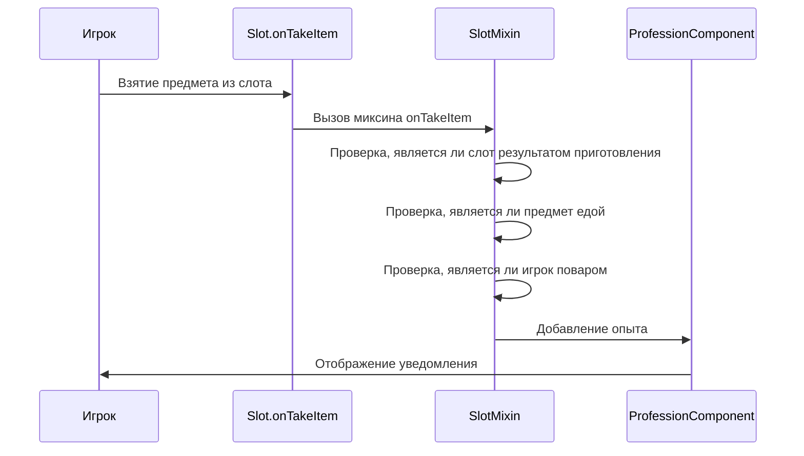

# Дизайн решения для исправления начисления опыта повару

## Обзор

Данный дизайн описывает решение проблемы с начислением опыта повару при взятии приготовленной еды из устройств приготовления (печь, коптильня, костер). В текущей реализации опыт начисляется только при подборе еды с земли, но не при взятии её из устройств приготовления.

## Архитектура

Система начисления опыта повару состоит из следующих компонентов:

1. **SlotMixin** - миксин для перехвата событий взятия предметов из слотов интерфейса
2. **PlayerInventoryFoodExpMixin** - миксин для начисления опыта при добавлении еды в инвентарь
3. **ProfessionComponent** - компонент для хранения и управления прогрессом профессий

Проблема заключается в том, что в текущей реализации SlotMixin не корректно определяет, является ли игрок поваром, и не учитывает все типы устройств приготовления.

## Компоненты и интерфейсы

### SlotMixin

Текущая реализация SlotMixin имеет следующие проблемы:

1. Проверка на принадлежность к профессии повара использует `comp.getCurrentProfessionId()`, но не учитывает, что игрок может иметь происхождение повара, но не иметь профессию повара.
2. Проверка типа инвентаря использует строковое сравнение `invClass.contains("Furnace")`, что не учитывает другие типы устройств приготовления.
3. Отладочные сообщения выводятся в консоль, что затрудняет отладку.

Необходимо модифицировать SlotMixin для корректного определения игрока-повара и учета всех типов устройств приготовления.

### Определение игрока-повара

Для корректного определения игрока-повара необходимо использовать как проверку профессии, так и проверку происхождения:

```java
private boolean isPlayerCook(ServerPlayerEntity player) {
    // Проверка по профессии
    ProfessionComponent comp = ProfessionComponent.KEY.get(player);
    if (comp != null && "origins:cook".equals(String.valueOf(comp.getCurrentProfessionId()))) {
        return true;
    }
    
    // Проверка по происхождению
    OriginComponent originComponent = ModComponents.ORIGIN.get(player);
    var origin = originComponent.getOrigin(OriginLayers.getLayer(Origins.identifier("origin")));
    return origin != null && origin.getIdentifier().toString().equals("origins:cook");
}
```

### Определение устройств приготовления

Для корректного определения всех типов устройств приготовления необходимо проверять класс инвентаря и индекс слота:

```java
private boolean isCookingResultSlot(Slot slot) {
    if (slot.inventory == null) return false;
    
    String invClass = slot.inventory.getClass().getName();
    int slotIdx = slot.getIndex();
    
    // Проверка для печи, коптильни и костра
    return (invClass.contains("Furnace") || invClass.contains("Smoker") || invClass.contains("Campfire")) && slotIdx == 2;
}
```

## Модель данных

Существующая модель данных не требует изменений. Используются следующие компоненты:

1. **ProfessionComponent** - для хранения прогресса профессий
2. **OriginComponent** - для определения происхождения игрока

## Обработка ошибок

Для предотвращения исключений при работе с миксинами необходимо:

1. Добавить проверки на null для всех используемых объектов
2. Обернуть критический код в блоки try-catch
3. Логировать ошибки для облегчения отладки

```java
try {
    // Код для начисления опыта
} catch (Exception e) {
    Origins.LOGGER.error("Ошибка при начислении опыта повару: " + e.getMessage());
}
```

## Стратегия тестирования

Для тестирования исправления необходимо:

1. Проверить начисление опыта при взятии еды из печи
2. Проверить начисление опыта при взятии еды из коптильни
3. Проверить начисление опыта при взятии еды из костра
4. Проверить, что опыт не начисляется при взятии не-еды
5. Проверить, что опыт не начисляется игрокам с другими происхождениями

## Диаграмма процесса

