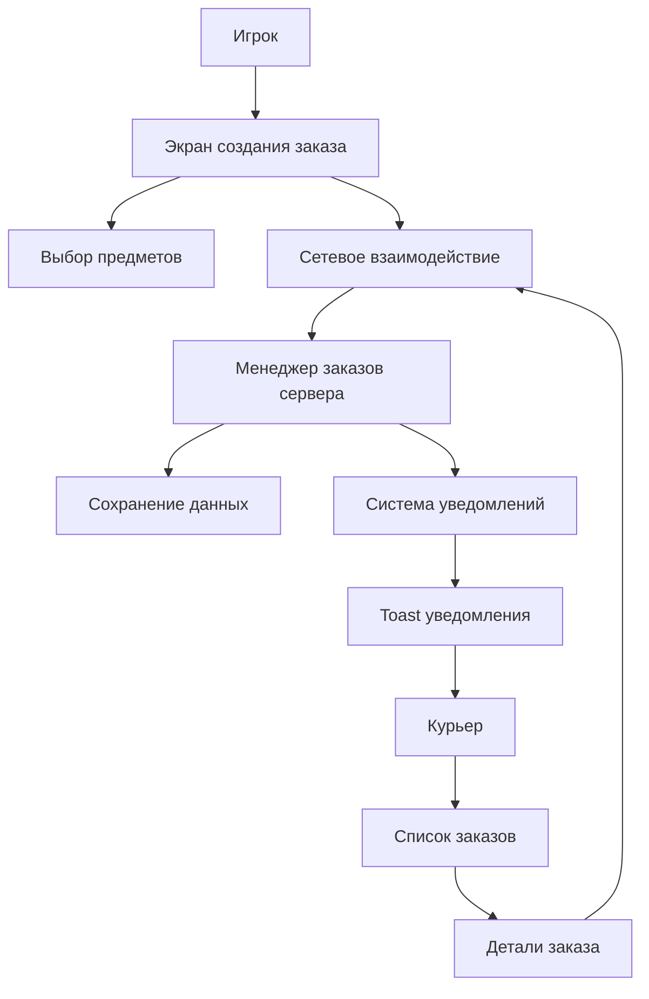

# Design Document

## Overview

Система заказов курьера представляет собой комплексную систему взаимодействия между игроками разных классов в Minecraft. Система позволяет игрокам создавать заказы на доставку предметов, а курьерам - принимать и выполнять эти заказы. Архитектура построена на клиент-серверной модели с использованием Fabric Networking API для синхронизации данных.

## Architecture

### Компоненты системы

1. **Серверная часть (Server-side)**
   - `CourierOrderManager` - управление заказами на сервере
   - `CourierNetworking` - обработка сетевых пакетов
   - `CourierCommand` - административные команды
   - `CourierOrderPersistence` - сохранение данных заказов

2. **Клиентская часть (Client-side)**
   - `CreateOrderScreen` - экран создания заказа
   - `OrdersListScreen` - список доступных заказов
   - `OrderDetailsScreen` - детальный просмотр заказа
   - `ItemPickerScreen` - выбор предметов с поиском
   - `ClientOrderManager` - управление заказами на клиенте

3. **Общие компоненты (Shared)**
   - `Order` - модель данных заказа
   - `OrderStatus` - статусы заказов
   - `CourierNetworkingConstants` - константы для сети

### Архитектурная диаграмма



## Components and Interfaces

### Серверные компоненты

#### CourierOrderManager
```java
public class CourierOrderManager extends PersistentState {
    // Управление жизненным циклом заказов
    public void createOrder(Order order);
    public void acceptOrder(UUID orderId, ServerPlayerEntity courier);
    public void declineOrder(UUID orderId, ServerPlayerEntity courier);
    public void completeOrder(UUID orderId);
    public List<Order> getActiveOrders();
    public List<Order> getOrdersForCourier(ServerPlayerEntity courier);
}
```

#### CourierNetworking
```java
public class CourierNetworking {
    // Константы пакетов
    public static final Identifier CREATE_ORDER = new Identifier("origins", "create_order");
    public static final Identifier ACCEPT_ORDER = new Identifier("origins", "accept_order");
    public static final Identifier DECLINE_ORDER = new Identifier("origins", "decline_order");
    public static final Identifier SYNC_ORDERS = new Identifier("origins", "sync_orders");
    public static final Identifier NEW_ORDER_NOTIFY = new Identifier("origins", "new_order_notify");
    
    // Методы отправки пакетов
    public static void sendOrdersToPlayer(ServerPlayerEntity player, List<Order> orders);
    public static void notifyNewOrder(Order order);
}
```

### Клиентские компоненты

#### CreateOrderScreen
- Интерфейс создания заказа с поддержкой до 10 предметов
- Интеграция с ItemPickerScreen для выбора предметов
- Валидация данных перед отправкой
- Красивый UI с адаптивным дизайном

#### OrdersListScreen
- Список заказов с прокруткой
- Фильтрация по статусу
- Кнопки действий для каждого заказа
- Автоматическое обновление при получении новых данных

#### ItemPickerScreen
- Поиск предметов в реальном времени
- Поддержка предметов из модов
- Пагинация для большого количества предметов
- Категоризация предметов

## Data Models

### Order
```java
public class Order {
    public enum Status { 
        OPEN,           // Заказ создан и доступен
        ACCEPTED,       // Заказ принят курьером
        IN_PROGRESS,    // Заказ выполняется
        COMPLETED,      // Заказ выполнен
        DECLINED,       // Заказ отклонен
        CANCELLED       // Заказ отменен
    }
    
    private UUID id;
    private String ownerName;
    private UUID ownerUuid;
    private String description;
    private List<ItemStack> requestItems;
    private List<ItemStack> rewardItems;
    private Status status;
    private String acceptedByName;
    private UUID acceptedByUuid;
    private long createdTime;
    private long acceptedTime;
    private long completedTime;
}
```

### ClientOrder
```java
public class ClientOrder {
    // Упрощенная версия Order для клиента
    // Содержит только необходимые для отображения данные
    public final UUID id;
    public final String ownerName;
    public final String description;
    public final List<ItemStack> requestItems;
    public final List<ItemStack> rewardItems;
    public final Order.Status status;
    public final String acceptedByName;
}
```

## Error Handling

### Сетевые ошибки
- Таймауты при отправке пакетов
- Потеря соединения с сервером
- Некорректные данные в пакетах
- **Решение:** Retry механизм, валидация данных, информативные сообщения пользователю

### Ошибки валидации
- Пустые заказы без предметов
- Некорректные количества предметов
- Слишком длинные описания
- **Решение:** Клиентская и серверная валидация, предупреждения пользователю

### Ошибки состояния
- Попытка принять уже принятый заказ
- Действия с несуществующими заказами
- Недостаточные права доступа
- **Решение:** Проверка состояния перед действиями, синхронизация данных

## Testing Strategy

### Unit Tests
- Тестирование модели данных Order
- Тестирование валидации заказов
- Тестирование сериализации/десериализации NBT
- Тестирование логики CourierOrderManager

### Integration Tests
- Тестирование сетевого взаимодействия
- Тестирование создания и принятия заказов
- Тестирование синхронизации данных между клиентом и сервером
- Тестирование системы уведомлений

### UI Tests
- Тестирование отзывчивости интерфейса
- Тестирование поиска предметов
- Тестирование адаптивности к разным размерам экрана
- Тестирование анимаций и переходов

## Implementation Details

### Сетевые пакеты

#### CREATE_ORDER
```java
// Клиент -> Сервер
PacketByteBuf buf = new PacketByteBuf(Unpooled.buffer());
buf.writeString(description);
buf.writeInt(requestItems.size());
for (ItemStack item : requestItems) {
    buf.writeItemStack(item);
}
buf.writeInt(rewardItems.size());
for (ItemStack item : rewardItems) {
    buf.writeItemStack(item);
}
```

#### SYNC_ORDERS
```java
// Сервер -> Клиент
PacketByteBuf buf = new PacketByteBuf(Unpooled.buffer());
buf.writeInt(orders.size());
for (Order order : orders) {
    buf.writeNbt(order.toNbt());
}
```

### UI Компоненты

#### Цветовая схема
- Основной цвет: `0x4A90E2` (синий)
- Акцентный цвет: `0x7ED321` (зеленый)
- Предупреждение: `0xF5A623` (оранжевый)
- Ошибка: `0xD0021B` (красный)
- Текст: `0xFFFFFF` (белый)
- Фон: `0x2C2C2C` (темно-серый)

#### Анимации
- Плавное появление экранов (fade-in)
- Анимация нажатия кнопок
- Плавная прокрутка списков
- Анимация загрузки данных

### Интеграция с Origins

#### Определение класса игрока
```java
public static String getPlayerClass(ServerPlayerEntity player) {
    var originComponent = ModComponents.ORIGIN.get(player);
    if (originComponent != null) {
        var origin = originComponent.getOrigin(OriginLayers.getLayer(Origins.identifier("origin")));
        if (origin != null) {
            String originId = origin.getIdentifier().toString();
            return switch (originId) {
                case "origins:courier" -> "courier";
                case "origins:warrior" -> "warrior";
                case "origins:miner" -> "miner";
                case "origins:blacksmith" -> "blacksmith";
                case "origins:brewer" -> "brewer";
                case "origins:cook" -> "cook";
                default -> "human";
            };
        }
    }
    return "human";
}
```

#### Команды для администраторов
```java
public class CourierCommand {
    public static void register(CommandDispatcher<ServerCommandSource> dispatcher) {
        dispatcher.register(CommandManager.literal("courier")
            .requires(source -> source.hasPermissionLevel(2))
            .then(CommandManager.literal("orders")
                .then(CommandManager.literal("list")
                    .executes(CourierCommand::listOrders))
                .then(CommandManager.literal("clear")
                    .executes(CourierCommand::clearOrders))
                .then(CommandManager.literal("stats")
                    .executes(CourierCommand::showStats))));
    }
}
```

## Performance Considerations

### Оптимизация сети
- Пакетная отправка заказов
- Сжатие данных для больших списков предметов
- Кэширование на клиенте для уменьшения запросов

### Оптимизация UI
- Виртуализация списков для большого количества заказов
- Ленивая загрузка предметов в ItemPickerScreen
- Оптимизация рендеринга иконок предметов

### Оптимизация памяти
- Очистка старых заказов
- Ограничение количества активных заказов на игрока
- Эффективное хранение данных в NBT