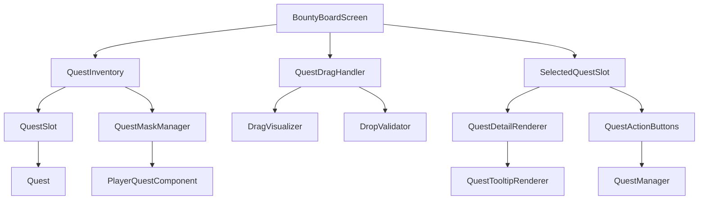

# Дизайн системы принятия квестов drag-and-drop

## Обзор

Система drag-and-drop для принятия квестов основана на оригинальной реализации Bountiful mod, адаптированной для интеграции с системой квестов Origins. Основные компоненты включают расширенный инвентарь доски объявлений, специальные слоты для квестов, и логику перетаскивания.

## Архитектура

### Компоненты системы

1. **QuestInventory** - расширенный инвентарь для хранения квестов
2. **QuestSlot** - специальный слот для квестов с поддержкой drag-and-drop
3. **SelectedQuestSlot** - слот для выбранного/принятого квеста
4. **QuestDragHandler** - обработчик логики перетаскивания
5. **QuestMaskManager** - управление маскировкой взятых квестов

### Диаграмма архитектуры



## Компоненты и интерфейсы

### 1. QuestInventory

Расширенный инвентарь для хранения квестов с поддержкой маскировки:

```java
public class QuestInventory extends SimpleInventory {
    private final Set<Integer> maskedSlots = new HashSet<>();
    private int selectedIndex = -1;
    
    public void maskSlot(int index);
    public void unmaskSlot(int index);
    public boolean isSlotMasked(int index);
    public void selectQuest(int index);
    public Quest getSelectedQuest();
}
```

### 2. QuestSlot

Специальный слот для квестов с поддержкой drag-and-drop:

```java
public class QuestSlot extends Slot {
    private final QuestInventory questInventory;
    
    @Override
    public boolean canInsert(ItemStack stack);
    @Override
    public boolean canTakeItems(PlayerEntity player);
    @Override
    public void onTakeItem(PlayerEntity player, ItemStack stack);
}
```

### 3. SelectedQuestSlot

Слот для выбранного квеста:

```java
public class SelectedQuestSlot extends Slot {
    private final QuestInventory questInventory;
    
    @Override
    public boolean canInsert(ItemStack stack);
    @Override
    public ItemStack getStack();
    @Override
    public void setStack(ItemStack stack);
}
```

### 4. QuestDragHandler

Обработчик логики перетаскивания:

```java
public class QuestDragHandler {
    public boolean startDrag(Quest quest, int mouseX, int mouseY);
    public void updateDrag(int mouseX, int mouseY);
    public boolean completeDrag(int mouseX, int mouseY);
    public void cancelDrag();
    public boolean isDragging();
}
```

### 5. QuestMaskManager

Управление маскировкой квестов:

```java
public class QuestMaskManager {
    private final Map<UUID, Set<Integer>> playerMasks = new HashMap<>();
    
    public void maskQuestsForPlayer(UUID playerId, Quest quest);
    public void unmaskQuestsForPlayer(UUID playerId, Quest quest);
    public Set<Integer> getMaskedSlots(UUID playerId);
}
```

## Модели данных

### QuestItem

Представление квеста как предмета для drag-and-drop:

```java
public class QuestItem extends Item {
    public static ItemStack createQuestStack(Quest quest);
    public static Quest getQuestFromStack(ItemStack stack);
    public static boolean isQuestStack(ItemStack stack);
}
```

### QuestDragState

Состояние перетаскивания:

```java
public class QuestDragState {
    private Quest draggedQuest;
    private int sourceSlot;
    private boolean isDragging;
    private int mouseX, mouseY;
    
    // Методы управления состоянием
}
```

## Обработка ошибок

### Валидация перетаскивания

1. **Проверка совместимости квеста** - квест должен подходить классу игрока
2. **Проверка доступности слота** - целевой слот должен быть свободен
3. **Проверка маскировки** - квест не должен быть замаскирован
4. **Проверка активных квестов** - игрок не должен иметь аналогичный активный квест

### Обработка исключений

```java
public enum QuestDragError {
    INVALID_QUEST_CLASS("Квест не подходит вашему классу"),
    SLOT_OCCUPIED("Слот уже занят"),
    QUEST_MASKED("Квест недоступен"),
    DUPLICATE_ACTIVE("У вас уже есть похожий квест"),
    INVALID_DROP_TARGET("Неверная цель для сброса");
    
    private final String message;
}
```

## Стратегия тестирования

### 1. Модульное тестирование

- Тестирование QuestInventory на корректность маскировки
- Тестирование QuestSlot на валидацию вставки/извлечения
- Тестирование QuestDragHandler на логику перетаскивания

### 2. Интеграционное тестирование

- Тестирование взаимодействия с BountyBoardScreenHandler
- Тестирование синхронизации клиент-сервер
- Тестирование интеграции с системой активных квестов

### 3. UI тестирование

- Тестирование визуальной обратной связи при перетаскивании
- Тестирование отзывчивости интерфейса
- Тестирование корректности отображения подсказок

## Производительность

### Оптимизации

1. **Кэширование маскированных слотов** - избежание пересчета при каждом рендере
2. **Ленивая загрузка квестов** - загрузка деталей квеста только при необходимости
3. **Батчинг обновлений** - группировка обновлений интерфейса
4. **Оптимизация рендеринга** - использование спрайт-атласов для иконок квестов

### Метрики производительности

- Время отклика на drag-and-drop операции: < 16ms
- Потребление памяти на квест: < 1KB
- Время загрузки списка квестов: < 100ms

## Безопасность

### Валидация на сервере

1. **Проверка прав доступа** - игрок может взаимодействовать только со своими квестами
2. **Валидация состояния** - проверка корректности переходов состояний квестов
3. **Защита от дублирования** - предотвращение создания дубликатов активных квестов
4. **Ограничение скорости** - защита от спама операциями с квестами

### Синхронизация клиент-сервер

```java
public class QuestSyncPacket {
    public static void syncQuestSelection(ServerPlayerEntity player, int questIndex);
    public static void syncQuestMask(ServerPlayerEntity player, Set<Integer> maskedSlots);
    public static void syncDragState(ServerPlayerEntity player, QuestDragState state);
}
```

## Совместимость

### Интеграция с существующими системами

1. **BountyBoardBlockEntity** - расширение для поддержки маскировки
2. **QuestManager** - интеграция с системой активных квестов
3. **PlayerQuestComponent** - хранение состояния маскировки игрока
4. **QuestRegistry** - регистрация новых типов слотов и предметов

### Обратная совместимость

- Существующие квесты продолжают работать без изменений
- Старый интерфейс остается функциональным как fallback
- Сохранение данных совместимо с предыдущими версиями