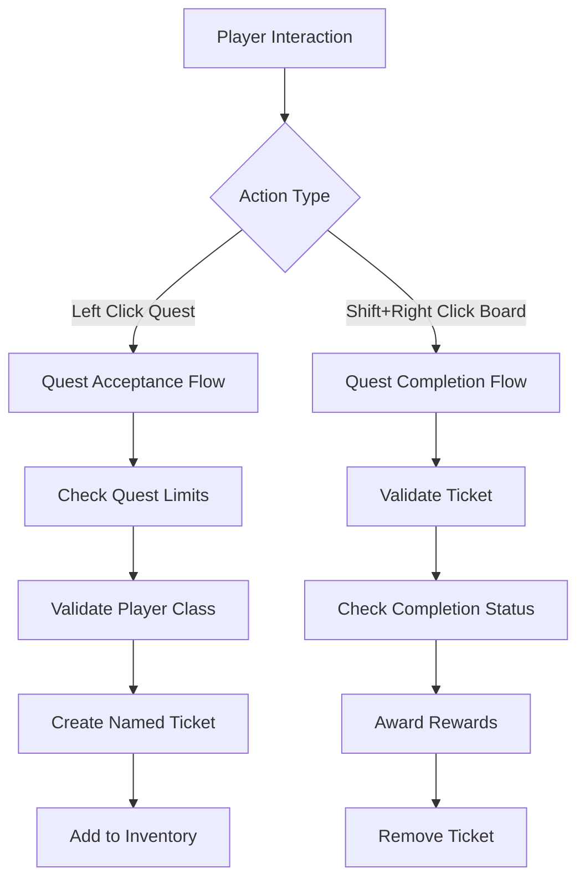

# Design Document

## Overview

This design addresses three critical issues in the quest system: multiple quest support, informative quest ticket naming, and quest completion via bounty board interaction. The solution involves modifying the quest acceptance logic, enhancing quest ticket display functionality, and implementing proper quest completion handling.

## Architecture

### Current System Analysis

The current quest system has several architectural limitations:

1. **QuestManager.canTakeQuest()** incorrectly blocks all quest acceptance if any active quest exists
2. **QuestTicketItem** creates generic tickets without quest-specific information in the display name
3. **BountyBoard** lacks Shift+Right Click handling for quest completion
4. **QuestTicketAcceptanceHandler** has incomplete quest validation logic

### Proposed Architecture Changes



## Components and Interfaces

### 1. Enhanced QuestManager

**Modifications Required:**
- Fix `canTakeQuest()` to check quest limits instead of blocking all quests
- Improve quest limit validation logic
- Add better error reporting for quest acceptance failures

**New Methods:**
```java
public boolean canAcceptAdditionalQuest(PlayerEntity player)
public int getAvailableQuestSlots(PlayerEntity player)
public boolean hasSpecificActiveQuest(PlayerEntity player, String questId)
```

### 2. Enhanced QuestTicketItem

**Display Name Generation:**
- Override `getName()` to return quest-specific names
- Format: "Билет квеста: [Quest Title]"
- Include quest rarity and class information

**Tooltip Enhancements:**
- Show quest progress for active quests
- Display remaining time with color coding
- Add completion status indicators

**New Methods:**
```java
public static Text getQuestSpecificName(ItemStack stack)
public static void updateTicketDisplayName(ItemStack stack, Quest quest)
```

### 3. Enhanced BountyBoard Interaction

**Shift+Right Click Handler:**
- Detect Shift+Right Click with quest ticket in hand
- Validate quest completion status
- Process reward distribution
- Remove completed quest ticket

**Integration Points:**
- Modify `BountyBoard.onUse()` to handle different interaction types
- Add quest completion validation
- Integrate with reward system

### 4. Quest Progress Tracking System

**Progress Validation:**
- Real-time objective tracking
- Completion status updates
- Time limit enforcement

**Data Persistence:**
- Store progress in ticket NBT data
- Sync progress across client/server
- Handle quest state transitions

## Data Models

### Enhanced Quest Ticket NBT Structure

```json
{
  "quest_id": "string",
  "quest_title": "string", 
  "quest_class": "string",
  "quest_rarity": "string",
  "quest_state": "AVAILABLE|ACCEPTED|IN_PROGRESS|COMPLETED|FINISHED",
  "accept_time": "long",
  "completion_ready": "boolean",
  "display_name": "string",
  "objectives": {
    "objective_0": {
      "type": "string",
      "target": "string", 
      "amount": "int",
      "progress": "int",
      "completed": "boolean"
    }
  },
  "objectives_count": "int",
  "rewards": {
    "reward_0": {
      "type": "string",
      "tier": "int",
      "experience": "int"
    }
  },
  "rewards_count": "int"
}
```

### Quest State Management

**State Transitions:**
1. `AVAILABLE` → `ACCEPTED` (when player takes quest)
2. `ACCEPTED` → `IN_PROGRESS` (when player makes progress)
3. `IN_PROGRESS` → `COMPLETED` (when all objectives met)
4. `COMPLETED` → `FINISHED` (when quest turned in)

## Error Handling

### Quest Acceptance Errors

**Error Types:**
- `QUEST_LIMIT_REACHED`: Player has maximum active quests
- `INVENTORY_FULL`: No space for quest ticket
- `PROFESSION_MISMATCH`: Wrong player class
- `ALREADY_HAS_QUEST`: Duplicate quest attempt
- `QUEST_INVALID`: Malformed quest data

**Error Recovery:**
- Clear error messages to player
- Suggest corrective actions
- Graceful fallback for corrupted data

### Quest Completion Errors

**Validation Checks:**
- Quest ticket validity
- Objective completion status
- Time limit enforcement
- Player eligibility

**Error Messages:**
- "Квест еще не выполнен! Проверьте все условия."
- "Время выполнения квеста истекло."
- "Неверный билет квеста."

## Testing Strategy

### Unit Tests

**QuestManager Tests:**
- Multiple quest acceptance scenarios
- Quest limit enforcement
- Error condition handling

**QuestTicketItem Tests:**
- Display name generation
- Tooltip content validation
- NBT data integrity

**Quest Completion Tests:**
- Objective validation
- Reward distribution
- State transitions

### Integration Tests

**End-to-End Scenarios:**
1. Player accepts multiple quests
2. Player completes quest objectives
3. Player turns in completed quest
4. Error handling for invalid operations

### Manual Testing

**User Experience Tests:**
- Quest ticket readability in inventory
- Intuitive quest completion process
- Clear error messaging
- Performance with multiple active quests

## Implementation Phases

### Phase 1: Multiple Quest Support
- Fix QuestManager quest acceptance logic
- Update quest limit validation
- Test multiple quest scenarios

### Phase 2: Quest Ticket Enhancement
- Implement dynamic display names
- Enhance tooltip information
- Add progress tracking display

### Phase 3: Quest Completion System
- Add Shift+Right Click handling to BountyBoard
- Implement quest validation logic
- Integrate reward distribution

### Phase 4: Polish and Testing
- Comprehensive error handling
- User experience improvements
- Performance optimization

## Performance Considerations

### Memory Usage
- Efficient NBT data storage
- Minimize quest data duplication
- Clean up completed quest data

### Network Traffic
- Batch quest state updates
- Minimize client-server synchronization
- Optimize tooltip rendering

### Server Performance
- Efficient quest lookup algorithms
- Minimize database queries
- Cache frequently accessed quest data

## Security Considerations

### Quest Data Integrity
- Validate quest ticket authenticity
- Prevent quest duplication exploits
- Secure reward distribution

### Player Validation
- Verify player eligibility
- Prevent unauthorized quest completion
- Validate objective progress

## Compatibility

### Existing Save Data
- Graceful handling of old quest tickets
- Migration strategy for existing quests
- Backward compatibility maintenance

### Mod Integration
- Maintain existing API contracts
- Preserve quest system extensibility
- Support custom quest types