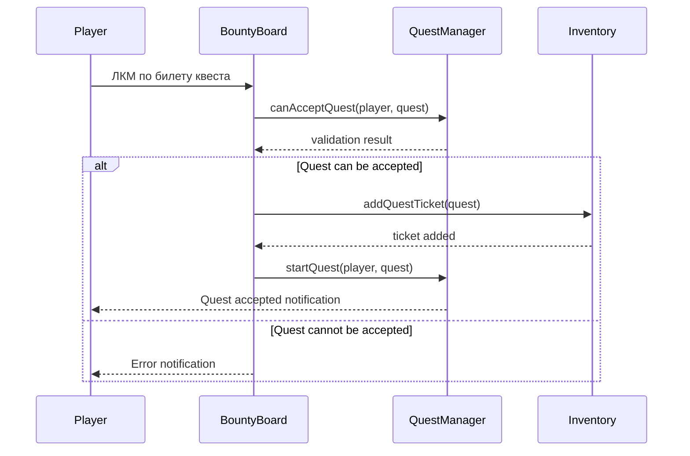
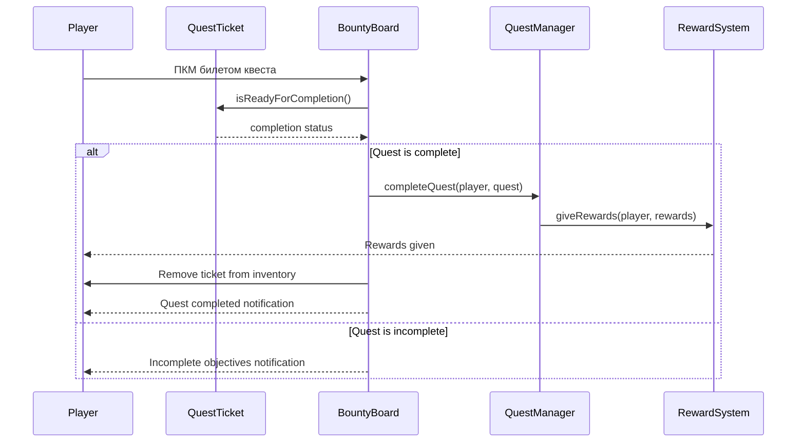
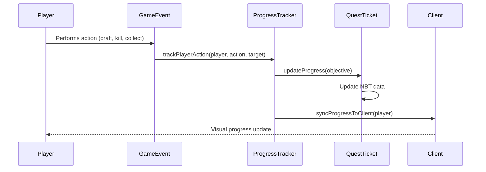

# Design Document

## Overview

Система принятия квестов через билеты интегрируется с существующей архитектурой квестов Origins, расширяя функциональность BountyBoardScreen и QuestTicketItem для поддержки интуитивного взаимодействия. Система использует механизм drag-and-drop и клики мыши для принятия и завершения квестов через физические билеты в инвентаре игрока.

## Architecture

### Core Components

1. **QuestTicketAcceptanceHandler** - новый компонент для управления логикой принятия квестов
2. **Enhanced QuestTicketItem** - расширение существующего класса билетов
3. **Enhanced BountyBoardScreen** - модификация экрана доски объявлений
4. **QuestProgressTracker** - компонент для отслеживания прогресса активных квестов
5. **QuestInventoryManager** - управление билетами в инвентаре игрока

### Integration Points

- **QuestManager** - интеграция с существующей системой управления квестами
- **ActiveQuest** - использование существующей структуры активных квестов
- **QuestDragHandler** - расширение существующего drag-and-drop функционала
- **PlayerOriginComponent** - интеграция с компонентом игрока для хранения состояния

## Components and Interfaces

### QuestTicketAcceptanceHandler

```java
public class QuestTicketAcceptanceHandler {
    // Принятие квеста через ЛКМ по билету
    public boolean acceptQuestFromBoard(PlayerEntity player, Quest quest, BountyBoardBlockEntity board);
    
    // Завершение квеста через ПКМ билетом по доске
    public boolean completeQuestAtBoard(PlayerEntity player, ItemStack ticketStack, BountyBoardBlockEntity board);
    
    // Отмена квеста через выбрасывание билета
    public void cancelQuestByDroppingTicket(PlayerEntity player, ItemStack ticketStack);
    
    // Проверка возможности принятия квеста
    public boolean canAcceptQuest(PlayerEntity player, Quest quest);
    
    // Проверка готовности квеста к завершению
    public boolean isQuestReadyForCompletion(PlayerEntity player, Quest quest);
}
```

### Enhanced QuestTicketItem

```java
public class QuestTicketItem extends Item {
    // Существующие методы...
    
    // Новые методы для системы принятия
    public boolean isAccepted(ItemStack stack);
    public void markAsAccepted(ItemStack stack, long acceptTime);
    public void updateProgress(ItemStack stack, QuestObjective objective);
    public boolean isReadyForCompletion(ItemStack stack);
    public void addVisualCompletionEffect(ItemStack stack);
    
    // Обработка использования билета на доске
    @Override
    public ActionResult useOnBlock(ItemUsageContext context);
}
```

### QuestProgressTracker

```java
public class QuestProgressTracker {
    // Автоматическое отслеживание прогресса
    public void trackPlayerAction(PlayerEntity player, String action, String target, int amount);
    
    // Обновление прогресса в билете
    public void updateTicketProgress(PlayerEntity player, ItemStack ticketStack);
    
    // Проверка выполнения целей
    public boolean checkObjectiveCompletion(QuestObjective objective, PlayerEntity player);
    
    // Синхронизация между клиентом и сервером
    public void syncProgressToClient(ServerPlayerEntity player);
}
```

### QuestInventoryManager

```java
public class QuestInventoryManager {
    // Поиск билетов квестов в инвентаре
    public List<ItemStack> findQuestTickets(PlayerEntity player);
    
    // Получение активного билета квеста
    public ItemStack getActiveQuestTicket(PlayerEntity player, String questId);
    
    // Проверка лимита активных квестов
    public boolean hasReachedQuestLimit(PlayerEntity player);
    
    // Добавление билета в инвентарь
    public boolean addQuestTicketToInventory(PlayerEntity player, Quest quest);
    
    // Удаление билета из инвентаря
    public void removeQuestTicketFromInventory(PlayerEntity player, String questId);
}
```

## Data Models

### Quest State Extensions

```java
public enum QuestTicketState {
    AVAILABLE,    // Доступен на доске
    ACCEPTED,     // Принят игроком
    IN_PROGRESS,  // В процессе выполнения
    COMPLETED,    // Готов к сдаче
    FINISHED      // Завершен и награда получена
}
```

### Enhanced NBT Structure

```java
// Дополнительные NBT поля для билетов
{
    "quest_state": "ACCEPTED",
    "accept_time": 1234567890L,
    "progress_data": {
        "objective_0": {
            "current": 5,
            "required": 10,
            "completed": false
        }
    },
    "completion_ready": false,
    "visual_effects": {
        "glowing": true,
        "particle_effect": "completion"
    }
}
```

## Error Handling

### Quest Acceptance Errors

1. **DuplicateQuestException** - попытка принять уже активный квест
2. **QuestLimitExceededException** - превышен лимит активных квестов
3. **IncompatibleClassException** - квест не подходит для класса игрока
4. **InventoryFullException** - нет места в инвентаре для билета

### Quest Completion Errors

1. **IncompleteObjectivesException** - не все цели выполнены
2. **ExpiredQuestException** - время квеста истекло
3. **InvalidTicketException** - билет поврежден или недействителен
4. **BoardNotAccessibleException** - доска объявлений недоступна

### Error Recovery Strategies

```java
public class QuestErrorHandler {
    // Восстановление поврежденных билетов
    public ItemStack repairCorruptedTicket(ItemStack corruptedTicket);
    
    // Синхронизация состояния при рассинхронизации
    public void resyncQuestState(PlayerEntity player, String questId);
    
    // Очистка зависших квестов
    public void cleanupStaleQuests(PlayerEntity player);
    
    // Уведомления об ошибках
    public void notifyPlayer(PlayerEntity player, QuestError error);
}
```

## Testing Strategy

### Unit Tests

1. **QuestTicketAcceptanceHandlerTest**
   - Тестирование принятия квестов
   - Тестирование завершения квестов
   - Тестирование отмены квестов
   - Тестирование валидации условий

2. **QuestProgressTrackerTest**
   - Тестирование отслеживания прогресса
   - Тестирование обновления билетов
   - Тестирование синхронизации

3. **QuestInventoryManagerTest**
   - Тестирование управления билетами
   - Тестирование лимитов квестов
   - Тестирование поиска билетов

### Integration Tests

1. **QuestAcceptanceFlowTest**
   - Полный цикл принятия квеста
   - Взаимодействие с доской объявлений
   - Обновление состояния игрока

2. **QuestCompletionFlowTest**
   - Полный цикл завершения квеста
   - Выдача наград
   - Очистка состояния

3. **QuestProgressFlowTest**
   - Автоматическое отслеживание прогресса
   - Обновление билетов в реальном времени
   - Синхронизация клиент-сервер

### User Experience Tests

1. **InteractionTest**
   - Тестирование ЛКМ по билетам
   - Тестирование ПКМ билетом по доске
   - Тестирование drag-and-drop

2. **VisualFeedbackTest**
   - Тестирование визуальных эффектов
   - Тестирование tooltip'ов
   - Тестирование анимаций

3. **ErrorHandlingTest**
   - Тестирование сообщений об ошибках
   - Тестирование восстановления после ошибок
   - Тестирование граничных случаев

## Implementation Flow

### Quest Acceptance Flow



### Quest Completion Flow



### Progress Tracking Flow



## Performance Considerations

### Optimization Strategies

1. **Lazy Loading** - загрузка данных квестов только при необходимости
2. **Caching** - кэширование часто используемых данных квестов
3. **Batch Updates** - групповое обновление прогресса
4. **Async Processing** - асинхронная обработка тяжелых операций

### Memory Management

1. **Quest State Cleanup** - автоматическая очистка завершенных квестов
2. **NBT Optimization** - оптимизация размера NBT данных
3. **Event Listener Management** - правильная регистрация/отмена слушателей

### Network Optimization

1. **Selective Sync** - синхронизация только измененных данных
2. **Compression** - сжатие больших пакетов данных
3. **Rate Limiting** - ограничение частоты обновлений